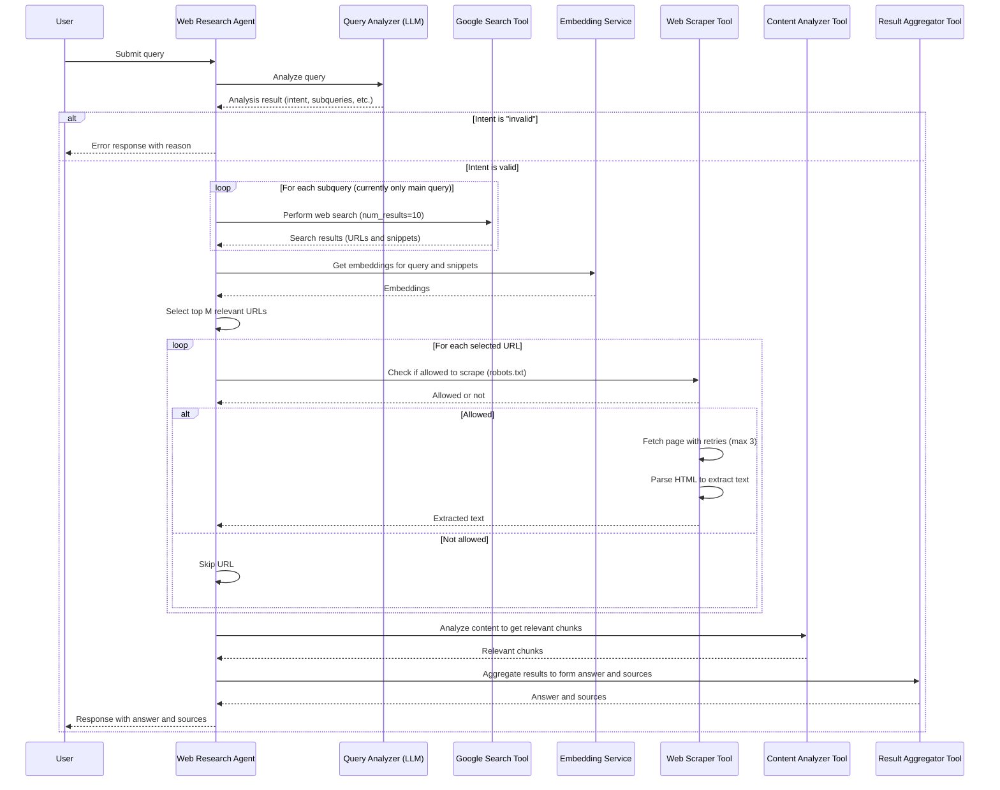

# Web Research Agent

This project implements a web research agent that processes user queries, performs web searches, scrapes relevant content, analyzes it, and returns a coherent answer with sources. The agent is built using FastAPI and leverages various tools and utilities to handle different stages of the research process.

---

## Table of Contents

- [Overview](#overview)
- [Project Structure](#project-structure)
- [How the Agent Works](#how-the-agent-works)
- [Integration with External Tools](#integration-with-external-tools)
- [Error Handling and Unexpected Situations](#error-handling-and-unexpected-situations)
- [Setup and Installation](#setup-and-installation)
- [Usage](#usage)
- [Testing](#testing)
- [License](#license)

---

## Overview

The web research agent is designed to automate the process of researching a user-submitted query. It analyzes the query, performs a web search, scrapes content from relevant URLs, extracts and analyzes the content, and aggregates the results into a final answer with sources. The agent is built as a FastAPI application, making it easy to deploy and interact with via HTTP requests.

---

## Project Structure

The project is organized into several key components:

- **`main.py`**: The entry point of the application, containing the FastAPI app and the main logic for processing research queries.
- **`utils/`**: Contains utility functions such as logging, query analysis, embedding generation, and URL selection.
  - `logging.py`: Sets up logging for the application.
  - `analyze_query.py`: Uses an LLM to analyze the user's query.
  - `get_embeddings.py`: Provides embeddings for text (e.g., for relevance ranking).
  - `get_relevant_urls.py`: Selects the most relevant URLs from search results.
- **`tools/`**: Contains tools for web searching, content analysis, web scraping, and result aggregation.
  - `web_search_tool.py`: Integrates with the Google Search API.
  - `content_analyzer_tool.py`: Analyzes scraped content to extract relevant chunks using a vector store.
  - `web_scraper_tool.py`: Scrapes content from web pages while respecting `robots.txt`.
  - `result_aggregator_tool.py`: Aggregates relevant content into a final answer.
- **`schemas.py`**: Defines the request and response models for the API.
- **`test_mock.py`**: Contains execute-research test to ensure the agent works correctly.
- **Chroma DB**: Used as a vector database to store and retrieve embeddings for relevance ranking.

---

## How the Agent Works

The agent follows a step-by-step process to handle a research query:

1. **Query Analysis**: The query is analyzed using an LLM to determine its intent, break it into subqueries (if complex), and identify the type of information needed.
2. **Web Search**: The agent performs a web search using the Google Search API to find relevant URLs and snippets.
3. **URL Selection**: Using embeddings, the agent selects the top `M` most relevant URLs from the search results. Chroma DB is used to store and retrieve embeddings efficiently.
4. **Web Scraping**: The agent scrapes content from the selected URLs, respecting `robots.txt` and handling retries for failed requests.
5. **Content Analysis**: The scraped content is analyzed to extract relevant chunks based on the query. A vector store (Chroma DB) is used to store the document embeddings, and the `get_relevant_documents` method retrieves the most relevant chunks for the query.
6. **Result Aggregation**: The relevant chunks are aggregated into a coherent answer, and sources are compiled.
7. **Response**: The final answer and sources are returned to the user.

If the query is invalid or harmful, the agent returns an error message immediately after analysis.

---

## Flowchart

The following flowchart illustrates the process:



---

## Integration with External Tools

The agent connects to and uses several external tools and libraries:

- **Google Search API**: Used for performing web searches. The `get_google_search_tool` function initializes the search tool, which is then used to fetch search results for the query.
- **BeautifulSoup**: Used in the `web_scraper_tool` to parse HTML and extract text content from web pages.
- **httpx**: An asynchronous HTTP client used for making requests to fetch web pages and check `robots.txt`.
- **AzureOpenAIEmbeddings**: The agent uses Azure OpenAI's embedding service to generate vector representations of the query and snippets for relevance ranking. These embeddings are stored and retrieved using Chroma DB.
- **AzureOpenAI**: The agent uses Azure OpenAI's LLM for query analysis, content generation, and result aggregation. It powers the `analyze_query` and `run_result_aggregator_tool` functions.
- **RobotFileParser**: Ensures that the agent respects `robots.txt` rules when scraping websites.
- **Embeddings**: The agent uses an embedding service (e.g., OpenAI embeddings) to generate vector representations of the query and snippets for relevance ranking.
- **Chroma DB**: A vector database used to store and retrieve embeddings efficiently during the URL selection process and content analysis. The `get_relevant_documents` method is used to retrieve the most relevant chunks for the query.

These tools are integrated via modular functions in the `tools/` and `utils/` directories, making it easy to swap or update them if needed.

---

## Error Handling and Unexpected Situations

The agent is designed to handle various errors and unexpected situations gracefully:

- **Invalid Queries**: If the query analysis determines that the query is invalid (e.g., harmful or nonsensical), the agent returns an error response immediately with a reason.
- **Web Search Failures**: If the web search tool fails (e.g., due to API limits or network issues), the global exception handler catches the error and returns a 500 status code with a generic error message.
- **Scraping Failures**:
  - If a URL is unreachable, the scraper retries up to 3 times with exponential backoff.
  - If scraping is not allowed by `robots.txt`, the URL is skipped.
  - If all URLs fail to scrape, the agent proceeds with an empty content list, which may lead to a "no relevant information found" response.
- **Content Analysis Issues**: If no relevant content is found after analysis, the agent returns a message indicating that no relevant information was found.
- **Conflicting Information**: The result aggregator tool is responsible for resolving conflicts by prioritizing recent and credible sources. The exact logic is implemented in `run_result_aggregator_tool`.

Additionally, a global exception handler is set up in FastAPI to catch any unhandled exceptions, log them, and return a user-friendly error message.

---

## Setup and Installation

To set up and run the web research agent, follow these steps:

1. **Clone the repository**:
   ```bash
   git clone https://github.com/your-repo/web-research-agent.git
   cd web-research-agent
   ```

2. **Install dependencies**:
   ```bash
   pip install -r requirements.txt
   ```

3. **Set up environment variables**:
   ```bash
   cp .env.example .env
   ```

4. **Run the application**:
   ```bash
   uvicorn main:app --host 0.0.0.0 --port 8000
   ```

The agent will be available at `http://localhost:8000`.

---

## Usage

To use the agent, send a POST request to the `/execute-research` endpoint with a JSON body containing the query:

```bash
curl -X POST http://localhost:8000/execute-research -H "Content-Type: application/json" -d '{"query": "What is the capital of France?"}'
```

The response will contain the answer and sources:

```json
{
  "query": "What is the capital of France?",
  "result": {
    "content": "The capital of France is Paris.",
    "sources": ["https://en.wikipedia.org/wiki/Paris"]
  }
}
```

For invalid queries, the response will include an error message:

```json
{
  "query": "asdasd",
  "result": {
    "content": "Invalid query: The query contains random letters.",
    "sources": []
  }
}
```

---

## Testing
Tests the end-to-end functionality of the `/execute-research` endpoint.

To run the test, use:

```bash
pytest test_mock.py
```

---

## License

This project is licensed under the MIT License. See the [LICENSE](LICENSE) file for details.

---